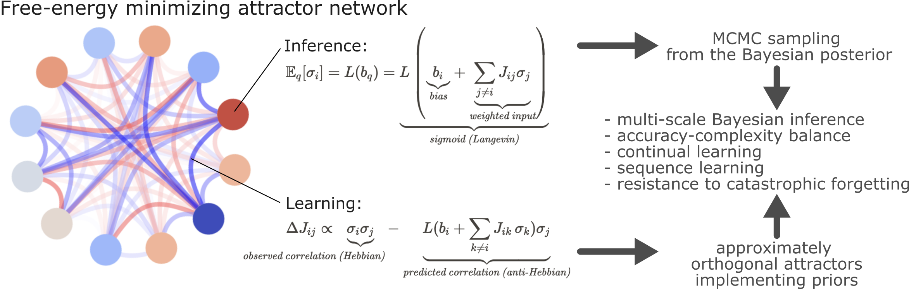

+++ {"part": "key-points"}
- Attractor networks are derived from the Free Energy Principle (FEP) applied to a universal partitioning of random dynamical systems.
- This approach yields emergent, biologically plausible inference and learning dynamics, forming a multi-level Bayesian active inference process.
- The networks favor approximately orthogonalized attractor representations, optimizing predictive accuracy and model complexity.
- Sequential data presentation leads to asymmetric couplings and non-equilibrium steady-state dynamics, extending conventional Boltzmann Machines.
- Simulations demonstrate orthogonal basis formation, generalization, sequence learning, and resistance to catastrophic forgetting.
+++

+++ {"part": "abstract"}
Attractor dynamics are a hallmark of many complex systems, including the brain. Understanding how such self-organizing dynamics emerge from first principles is crucial for advancing our understanding of neuronal computations and the design of artificial intelligence systems.
Here we formalize how attractor networks emerge from the free energy principle applied to a universal partitioning of random dynamical systems. Our approach obviates the need for explicitly imposed learning and inference rules and identifies emergent, but efficient and biologically plausible inference and learning dynamics for such self-organizing systems. These result in a collective, multi-level Bayesian active inference process. Attractors on the free energy landscape encode prior beliefs; inference integrates sensory data into posterior beliefs; and learning fine-tunes couplings to minimize long-term surprise.
Analytically and via simulations, we establish that the proposed networks favor approximately orthogonalized attractor representations, a consequence of simultaneously optimizing predictive accuracy and model complexity. These attractors efficiently span the input subspace, enhancing generalization and the mutual information between hidden causes and observable effects. Furthermore, while random data presentation leads to symmetric and sparse couplings, sequential data fosters asymmetric couplings and non-equilibrium steady-state dynamics, offering a natural extension to conventional Boltzmann Machines.
Our findings offer a unifying theory of self-organizing attractor networks, providing novel insights for AI and neuroscience.
+++

**Graphical Abstract**
(graphical-abstract)=

# Introduction

From whirlpools and bird flocks to neuronal and social networks, countless natural systems can be characterized by dynamics organized around *attractor states* {cite:p}`https://doi.org/10.1007/978-3-642-96469-5`. Such systems can be decomposed into a collection of - less or more complex - building blocks or "particles" (e.g. water molecules, birds, neurons, or people), which are coupled through local interactions. Attractors are an emergent consequence of the collective dynamics of the system, arising from these local interactions, without any individual particles exerting global control.

Attractors are a key concept in dynamical systems theory, defined as a set of states in the state space of the system to which nearby trajectories converge {cite:p}`https://doi.org/10.1115/1.3167759`. Geometrically, the simplest attractors are fixed points and limit cycles (representing periodic oscillations). However, the concept extends to more complex structures like strange attractors associated with chaotic behavior, as well as phenomena arising in stochastic or non-equilibrium settings, such as probability distributions over states (stochastic attractors), transient states reflecting past dynamics (ghost attractors or attractor ruins), and trajectories that cycle through sequences of unstable states (sequential attractors or heteroclinic cycles).
Artificial attractor neural networks {cite:p}`https://doi.org/10.1017/CBO9780511623257` represent a class of recurrent neural networks specifically designed to leverage attractor dynamics. While the specific forms and behaviors of these networks are heavily influenced by the chosen inference and learning rules, self-organization is a key feature of all variants, as the stable states emerge from the interactions between network elements without explicit external coordination. This property makes them particularly relevant as models for self-organizing biological systems, including the brain.
It is clear that the brain is also a complex attractor network. Attractor dynamics have long been proposed to play a significant role in information integration at the circuit level {cite:p}`10.1007/BF00317988; https://doi.org/10.1017/CBO9780511623257; 10.1046/j.1460-9568.2003.02956.x; https://doi.org/10.48550/arXiv.2504.12188` (1098-1063(1999)9:4\<481::AID-HIPO14>3.0.CO\;2-S)) and have become established models for canonical brain circuits involved in motor control, sensory amplification, motion integration, evidence integration, memory, decision-making, and spatial navigation (see {cite:t}`https://doi.org/10.1038/s41583-022-00642-0` for a review). For instance, the activity of head direction cells - neurons that fire in a direction-dependent manner - are known to arise from a circular attractor state, produced by a so-called ring attractor network {cite:p}`10.1523/JNEUROSCI.16-06-02112.1996`. Multi- and metastable attractor dynamics have also been proposed to extend to the meso- and macro-scales {cite:p}`https://doi.org/10.1002/wcs.1`, "accommodating the coordination of heterogeneous elements" {cite:p}`https://doi.org/10.1098/rstb.2011.0351`, rendering attractor dynamics an overarching computational mechanism across different scales of brain function.
The brain, as an instance of complex attractor networks, showcases not only the computational capabilities of this network architecture but also its ability to emerge and evolve through self-organization. 

When discussing self-organization in attractor networks, we will differentiate two distinct levels. First, we can talk about *operational self-organization*: the capacity of a pre-formed network to settle into attractor states during its operation. This however does not encompass the network's ability to "build itself" – to emerge from simple, local interactions without explicit programming or global control, and to adaptively evolve its structure and function through learning. This latter level of self-organization is what we will refer to as *adaptive self-organization*.
Such architectures would mirror the nervous system's capacity to not just function as an attractor network, but to become - and remain - one through a self-directed process of development and learning. Further, adaptive self-organization would also be a highly desirable property for robotics and artificial intelligence systems, not only boosting their robustness and adaptability by means of continuous learning, but potentially leading to systems that can increase their complexity and capabilities organically over time (e.g. developmental robotics).
Therefore, characterizing *adaptive self-organization* in attractor networks is vital for advancing our understanding of the brain and for creating more autonomous, adaptive, brain-inspired AI systems.

The Free Energy Principle (FEP) offers a general framework to study self-organization to nonequilibrium steady states as Bayesian inference (a.k.a., active inference). The FEP has been pivotal in connecting the dynamics of complex self-organizing systems with computational and inferential processes, especially within the realms of brain function {cite:p}`https://doi.org/10.1016/j.physrep.2023.07.001; 10.1155/2012/937860; https://doi.org/10.1016/j.jtbi.2019.110089`. The FEP posits that any 'thing' - in order to exist for an extended period of time - must maintain conditional independence from its environment. This entails a specific sparsely coupled structure of the system, referred to as a *particular partition*, that divides the system into internal, external, and boundary (sensory and active) states (see A). It can be shown that maintaining this sparse coupling is equivalent to executing an inference process, where internal states deduce the causes of sensory inputs by minimizing variational free energy (see {cite:t}`https://doi.org/10.1016/j.physrep.2023.07.001` or {cite:p}`https://doi.org/10.1016/j.plrev.2023.08.016` for a formal treatment).

Here, we describe the specific class of adaptive self-organizing attractor networks that emerge directly from the FEP, without the need for explicitly imposed learning or inference rules.
First, we show that a hierarchical formulation of *particular partitions* - a concept that is applicable to any complex dynamical system - can give rise to systems that have the same functional form as well-known artificial attractor network architectures. 
Second, we show that minimizing variational free energy (VFE) with regard to the internal states of such systems yields a Boltzmann Machine-like stochastic update mechanism, with continuous-state stochastic Hopfield networks being a special case.
Third, we show that minimizing VFE with regard to the internal blanket or boundary states of the system (couplings) induces a generalized predictive coding-based learning process. Crucially, this adaptive process extends beyond simply reinforcing concrete sensory patterns; it learns to span the entire subspace of key patterns by establishing approximately-orthogonalized attractor representations, which the system can then combine during inference.
We use simulations to identify the requirements for the emergence of quasi-orthogonal attractors and to illustrate the derived attractor networks' ability to generalize to unseen data. Finally, we highlight, that the derived attractor network can naturally produce sequence-attractors (if the input data is presented in a clear sequential order) and exemplify its potential to perform continual learning and to overcome catastrophic forgetting by means of spontaneous activity.
We conclude by discussing testable predictions of our framework, and exploring the broader implications of these findings for both natural and artificial intelligence systems.

# Main Results

## Background: particular partitions and the free energy principle

Our effort to characterize self-organizing attractor networks calls for an individuation of 'self' from nonself. *Particular partitions*, a concept that is at the core of the Free Energy Principle (FEP) {cite:p}`https://doi.org/10.48550/arXiv.2210.12761; https://doi.org/10.1016/j.physrep.2023.07.001; 10.1155/2012/937860; https://doi.org/10.1016/j.jtbi.2019.110089`, is a natural way to formalize this individuation.
A particular partition is a partition that divides the states of a system $x$ into a particle or 'thing' $(s,a,\mu) \subset x$ and its external states $\eta \subset x$, based on their sparse coupling:

:::{math}
:label: eq-particular-partition
\begin{align*}
\begin{bmatrix}
\dot{\eta}(\tau) \\
\dot{s}(\tau) \\
\dot{a}(\tau) \\
\dot{\mu}(\tau)
\end{bmatrix}
=
\begin{bmatrix}
f_{\eta}(\eta, s, a) \\
f_{s}(\eta, s, a) \\
f_{a}(s, a, \mu) \\
f_{\mu}(s, a, \mu)
\end{bmatrix}
+
\begin{bmatrix}
\omega_{\eta}(\tau) \\
\omega_{s}(\tau) \\
\omega_{a}(\tau) \\
\omega_{\mu}(\tau)
\end{bmatrix}
\end{align*}
:::

where $\mu$, $s$ and $a$ are the internal, sensory and active states of the particle, respectively. The fluctuations $\omega_i, i \in (\mu, s, a, \eta)$ are assumed to be mutually independent. The particular states $\mu$, $s$ and $a$ are coupled to each other with *particular flow dependencies*; namely, external states can only influence themselves and sensory states, while internal states can only influence themselves and active states (see A). It can be shown that these coupling constraints mean that external and internal paths are statistically independent, when conditioned on blanket paths {cite:p}`https://doi.org/10.48550/arXiv.2210.12761`:

:::{math}
:label: eq-conditional-independence
\eta \perp \mu \mid s, a.
:::

As shown by {cite:t}`https://doi.org/10.1016/j.plrev.2023.08.016`, such a particle, in order to persist for an extended period of time, will necessarily have to maintain this conditional independence structure, a behavior that is equivalent to an inference process in which internal states infer external states through the blanket states (i.e., sensory and active states) by minimizing free energy {cite:p}`https://doi.org/10.1371/journal.pone.0006421; https://doi.org/10.1038/nrn2787; https://doi.org/10.1016/j.physrep.2023.07.001`:

:::{math}
:label: eq-free-energy-principle
\eta \perp \mu \mid s, a \quad \Rightarrow \quad \dot{\mu} = -\nabla_{\mu} F(s, a, \mu)
:::

where $F(s, a, \mu)$ is the variational free energy (VFE):

:::{math}
:label: eq-free-energy-functional
F(s,a,\mu) = \mathbb{E}_{q_\mu(\eta)}[\ln q_\mu(\eta) - \ln p(s,a,\eta)]
:::

with $q_\mu(\eta)$ being a variational density over the external states that is parameterized by the internal states and $p(s,a,\eta)$ being the joint probability distribution of the sensory, active and external states, a.k.a. the generative model {cite:p}`10.1016/j.neubiorev.2016.06.022`.

 :::{figure} fig/concept.png
 :name: fig-concept
 :width: 66%
 **Deep Particular Partitions.** \
 **A** Schematic illustration of a particular partition of a system into internal ($\mu$) and external states ($\eta$), separated by a Markov blanket consisting of sensory states ($s$) and active states ($a$). The tuple $(\mu, s, a)$ is called a *particle*. A particle, in order to persist for an extended period of time, will necessarily have to maintain its Markov blanket, a behavior that is equivalent to an inference process in which internal states infer external states through the blanket states. The resulting self-organization of internal states corresponds to perception, while actions link the internal states back to the external states.
**B** The internal states $\mu \subset x$ can be arbitrarily complex. Without loss of generality, we can consider that the macro-scale $\mu$ can be decomposed into set of overlapping micro-scale *subparticles* ($\sigma_i, s_i, a_i, s_{ij}, a_{ij}$), so that the internal state of subparticle $\sigma_i \subset \mu$ can be an external state from the perspective of another subparticle $\sigma_j \subset \mu$. Some, or all subparticles can be connected to the macro-scale external state $\eta$, through the macro-scale Markov blanket, giving a decomposition of the original boundary states into $s_i \subset s$ and $a_i \subset a$. The subparticles are connected to each other by the micro-scale boundary states $s_{ij}$ and $a_{ij}$. Note that this notation considers the point-of-view of the $i$-th subparticle. Taking the perspective of the $j$-th subparticle, we can see that $s_{ji}=a_{ij}$ and $a_{ji}=s_{ij}$. While the figure depicts the simplest case of two nested partitions, the same scheme can be applied recursively to any number of (possibly nested) subparticles and any coupling structure amongst them.
 :::

## Deep particular partitions and subparticles

Particular partitions provide a universal description of complex systems, in a sense that the internal states $\mu$ behave as if they are inferring the external states under a generative model; i.e., a 'black box' inference process (or computation), which can be arbitrarily complex. At the same time, the concept of particular partitions speaks to a recursive composition of ensembles (of things) at increasingly higher spatiotemporal scales {cite:p}`https://doi.org/10.48550/arXiv.1906.10184; https://doi.org/10.1016/j.jtbi.2019.110089; https://doi.org/10.15502/9783958573031`, which yields a natural way to resolve the internal complexity of $\mu$. Partitioning the "macro-scale" particle $\mu$ into multiple, overlapping "micro-scale" *subparticles* $\{\pi_i\}_{i=1}^n$ - that themselves are particular partitions - we can unfold the complexity of the macro-scale particle to an arbitrary degree. As subparticles can be nested arbitrarily deep - yielding a hierarchical generative model - we refer to such a partitioning as a *deep particular partition*. 

As illustrated in B, each subparticle $\pi_i$ has internal states $\sigma_i$, and the coupling between any two subparticles $i$ and $j$ is mediated by micro-scale boundary states: sensory states $s_{ij}$ (representing the sensory information in $i$ coming from $j$) and active states $a_{ij}$ (representing the action of $i$ on $j$). The boundary states of subparticles naturally overlap; the sensory state of a subparticle $\sigma_i$ is the active state of $\sigma_j$ and vice versa, i.e. $a_{ji}=s_{ij}$ and $s_{ji}=a_{ij}$. This also means that, at the micro-scale, the internal state of a subparticle $\sigma_i \subset \mu$ is part of the external states for another subparticle in $\sigma_j \subset \mu$. Accordingly, the internal state of a subparticle $\sigma_i$ is conditionally independent of any other internal states $\sigma_j$ with $j \neq i$, given the blanket states of the subparticles:

:::{math}
\sigma_i \perp \sigma_j \mid a_{ij}, s_{ij}
:::

Note that this definition embraces sparse couplings across subparticles, as $a_{ij}$ and $s_{ij}$ may be empty for a given $j$ (no direct connection between the two subparticles), but we require the subparticles to yield a *complete coverage* of $\mu$: $\bigcup_{i=1}^n \pi_i = \mu$.

## The emergence of attractor neural networks from deep particular partitions

Next, we establish a prototypical mathematical parametrization for an arbitrary deep particular partition, shown on , with the aim of demonstrating that such complex, sparsely coupled random dynamical systems can give rise to artificial attractor neural networks.

 ::: {figure} fig/parametrization.png
 :name: fig-parametrization
 :width: 50%
 **Parametrization of subparticles in a deep particular partition.**  
The internal state $\sigma_i$ of subparticle $\pi_i$ follows a continuous Bernoulli distribution, (a.k.a. a truncated exponential distribution supported on the interval $[-1, +1] \subset \mathbb{R}$, see ), with a prior "bias" $b_i$ that can be interpreted as a priori log-odds evidence for an event (stemming from a macro-scale sensory input $s_{i}$ - not shown, or from the internal dynamics of $\sigma_i$ itself, e.g. internal sequence dynamics).
The state $\sigma_i$ is coupled to the internal state of another subparticle $\sigma_j$ through the micro-scale boundary states $s_{ij}$ and $a_{ij}$. The boundary states simply apply a deterministic scaling to their respective $\sigma$ state, with a weight ($J_{ij}$) implemented by a Dirac delta function shifted by $J_{ij}$ (i.e. we deal with conservative subparticles, in the sense of {cite:t}`https://doi.org/10.1016/j.plrev.2023.08.016`). The state $\sigma_i$ is influenced by its sensory input $s_i$ in a way that $s_i$ gets integrated into its internal bias, updating the level of evidence for the represented event.
 :::

In our example parametrization, we assume that the internal states of subparticles in a complex particular partition are *continuous* Bernoulli states (also known as a truncated exponential distribution, see  for details), denoted by $\sigma_i \sim \mathcal{CB}_{b_i}$:

:::{math}
:label: prior-sigma
p(\sigma_i) \propto e^{b\sigma_i}
:::

Here, $\sigma_i \in [-1, +1] \subset \mathbb{R}$, and $b_i \in \mathbb{R}$ represents an a priori bias (e.g. the level of prior log-odds evidence for an event) in $\sigma_i$ . Zero bias represents a flat prior (uniform distribution over [-1,1]), while positive or negative biases represent evidence for or against an event, respectively.
The above probability is defined up to a normalization constant, $b_i / (2\sinh(b_i))$. See  for details. 

Next, we define the conditional probabilities of the sensory and active states, creating the boundary between two subparticles $\sigma_i$ and $\sigma_j$: $s_{ij}|\sigma_j \sim \mathcal{\delta}_{J_{ij}\sigma_j}$ and $a_{ij} |\sigma_i \sim \mathcal{\delta}_{J_{ji}\sigma_i}$, where $\mathcal{\delta}$ is the Dirac delta function and $\bm{J}$ is a weight matrix. The elements $J_{ij}$ contains the weights of the coupling matrix (see ).

Expressed as PDFs:

:::{math}
p(s_{ij} | \sigma_j) = \delta(s_{ij} - J_{ij}\sigma_j)
:::
:::{math}
p(a_{ij} | \sigma_i) = \delta(a_{ij} - J_{ji}\sigma_i) 
:::

The choice of this deterministic parametrization means that we introduce the assumption of the subparticles being conservative particles, as defined in {cite:t}`https://doi.org/10.1016/j.plrev.2023.08.016`. 

To close the loop, we define how the internal state $\sigma_i$ depends on its sensory input $s_{ij}$. We assume the sensory input simply adds to the prior bias $\sigma_i | s_{ij} \sim \mathcal{CB}_{b_i + s_{ij}}$:

:::{math}
p(\sigma_i | s_{ij}) \propto e^{(b_i + s_{ij})\sigma_i}
:::

With the continuous Bernoulli distribution, this simply means that the sensory evidence $s_{ij}$ adds to (or subtracts from) the prior belief $b_i$.

We now write up the direct conditional probability describing $\sigma_i$ given $\sigma_j$, marginalizing out the sensory and active states:

:::{math}
:label: sigma-given-mu
p(\sigma_i | \sigma_j) &= \int p(\sigma_i | s_{ij}) p(s_{ij} | \sigma_j) \, d s_{ij} \\
&\propto \int e^{(s_{ij}+b_i)\sigma_i} \delta( s_{ij} - J_{ij} \sigma_j ) d s_{ij} \\
&\propto e^{(b_i + J_{ij}\sigma_j)\sigma_i}
:::

:::{note}
The expected value of $p(\sigma_i | \sigma_j)$ is a sigmoid function of $\sigma_j$ , specifically the Langevin function. This property allows it to function as an activation function in neural networks, enabling the network to model more complex patterns and decision boundaries.
:::

Given that $p(\sigma_i, \sigma_j) = p(\sigma_i | \sigma_j) p(\sigma_j)$, and using equations  and , we can express the joint distribution as follows:

:::{math}
p(\sigma_i , \sigma_j) &= e^{(b_i + J_{ij}\sigma_j)\sigma_i} e^{ b_j \sigma_j} 
&= e^{b_i \sigma_i + J_{ij} \sigma_i \sigma_j + b_j \sigma_j}
:::

Next, we observe that the states $s_{ij}$ and $a_{ij}$ ($\forall i, j$) are the 'blanket states' of the system, forming a Markov blanket {cite:p}`https://doi.org/10.1016/j.neubiorev.2021.02.003`. The corresponding conditional independence structure implies that the joint probability for all $\bm{\sigma}$ nodes can be written as the product of the individual joint probabilities, $\prod_{i,j} P(\sigma_i, \sigma_j)$, which results in:

:::{math}
:label: multiple-integrator-joint
p(\bm{\sigma}) \propto e^{\sum_{i} b_i \sigma_i + \sum_{i \neq j} J_{ij}\sigma_i\sigma_j}
:::

However, since $\sigma_i \sigma_j = \sigma_j \sigma_i$, each undirected pair $\{i,j\}$ appears twice in the sum over directed pairs $(i,j)$ with $i \neq j$. This mathematical fact leads to an important consequence for the steady-state distribution.

Since $\sigma_i\,\sigma_j = \sigma_j\,\sigma_i$, we can rearrange the double sum over distinct pairs:

:::{math}
:label: antisymmetric-coupling
\sum_{i\neq j} J_{ij}\,\sigma_i\,\sigma_j = \sum_{i<j} \Bigl(J_{ij}+J_{ji}\Bigr)\,\sigma_i\,\sigma_j.
:::

Thus, even though we started with non-symmetric couplings $J_{ij}$ and $J_{ji}$, the joint distribution ends up depending only on the sum $J_{ij}+J_{ji}$:

:::{math}
:label: hopfield-joint
\boxed{
p(\bm{\sigma}) \propto \exp \Biggl\{ \underbrace{\underbrace{\sum_{i} b_i \sigma_i}_{\textit{bias term}} + \underbrace{ \sum_{ij} J^{\dagger}_{ij}\sigma_i\sigma_j}_{\textit{interaction term}} }_{\textit{-ve energy}} \Biggr\}
}
:::

with $\bm{J}^{\dagger} = \frac{1}{2} (\bm{J} + \bm{J}^\intercal)$ (meaning that the diagonal elements $J^{\dagger}_{ii} = 0$ for all $i$). 

This joint probability distribution takes the functional form of a stochastic continuous-state Hopfield network (a specific type of Boltzmann machines).  As known in such systems, regions of high probability density in this stationary distribution will constitute "stochastic attractors", which are the regions of the state space that the system will tend to converge to. Furthermore, in case of asymmetric couplings, the antisymmetric part of the coupling matrix induces "solenoidal flows", extending the attractor repertoire with "sequence attractors" (heteroclinic chains).
Importantly, our derivation shows that, while solenoidal flows that emerge with asymmetric couplings can break detailed balance and induce non-equilibrium dynamics, the stationary distribution retains a Boltzmann-like form determined by the symmetric part $\bm{J}^{\dagger}$. This relies on the assumption that the solenoidal flows are divergence-free - i.e. it does not alter the Boltzmann form of the stationary distribution but, instead it drives persistent, divergence-free probability currents along iso-potential surfaces.
This condition is argued to hold for conservative particles under a particular partition (see  and {cite:p}`https://doi.org/10.1016/j.plrev.2023.08.016`; but also {cite:t}`10.1088/0305-4470/37/3/L01`; {cite:t}`https://doi.org/10.1088/1751-8113/43/37/375003`). Under this condition, the antisymmetric part of the coupling acts only tangentially to the iso-potential surfaces defined by the symmetric part and, therefore, does not alter the form of the stationary distribution, merely driving probability fluxes along these surfaces. 
Nevertheless, as we will see in the next sections, the dynamics derived from local free energy minimization in this system still depend on the potentially asymmetric couplings $\bm{J}$.

## Inference

So far our derivation only relied on the sparsely coupled structure of the system (deep particular partition), but did not utilize the free energy principle itself. We now consider the implications of free energy minimization on the dynamics of the derived recurrent neural network. We start by expressing variational free energy (VFE, eq. ) from the point of view of a single node of the attractor network $\sigma_i$, given observations from all other nodes $\sigma_{\backslash i}$:

:::{math}
:label: free-energy-rnn
F &= \mathbb{E}_{q(\sigma_i)}[\ln q(\sigma_i) &-& \ln p(\sigma_{\backslash i}, \sigma_i)]
 = &\underbrace{D_{KL}[ q(\sigma_i) || p(\sigma_i)]}_{\textit{complexity} } &- &\underbrace{\mathbb{E}_{q(\sigma)}[ \ln p(\sigma_{\backslash i} | \sigma_i)]}_{\textit{accuracy}}
:::

Where $q(\sigma_i)$ is the approximate posterior distribution over $\sigma_i$, which we will parametrize as a $\mathcal{CB}$ with variational bias $b_q$.
We are now interested in how node $\sigma_i$ must update its bias, given the state of all other nodes, $\sigma_{\backslash i}$ and the weights $J_{ij}$. Intuitively, the last part of eq.  tells us that minimizing free energy will tend to pull the system towards a (local) minimum of the Boltzmann-like energy functional (eq. ) of the attractor network (accuracy term), with the constraint that this has to lie close to the initial state (complexity term).

Let us verify this intuition by substituting our parametrization into eq. . First, we rearrange eq.  to get:
 :::{math}
p(\sigma_{\backslash i} | \sigma_i) \propto \exp\left( \sum_{j \neq i} \left( b_j + J_{i,j} \sigma_i \right) \sigma_j + \frac{1}{2} \sum_{j \neq i} \sum_{k \neq i} J_{j,k} \sigma_j \sigma_k \right)
:::

Then, we express the accuracy term:

:::{math}
\mathbb{E}_{q(\sigma_i)} [ \ln p(\sigma_{\backslash i} \mid \sigma_i) ] = \text{const} + \sum_{j \ne i} b_j \sigma_j + L(b_q) \sum_{j \ne i} J_{ij} \sigma_j + \dfrac{1}{2} \sum_{j \ne i} \sum_{k \ne i} J_{jk} \sigma_j \sigma_k
:::

The complexity term in eq.  is simply the KL-divergence term between two $\mathcal{CB}$ distributions:

:::{math}
:label: kl-divergence-cb
D_{\text{KL}}[ q(\sigma_i) \| p(\sigma_i) ]
= \bigl[ \ln\!\bigl(\tfrac{b_q}{\sinh(b_q)}\bigr) + b_q\,L(b_q) \bigr]
- \bigl[ \ln\!\bigl(\tfrac{b}{\sinh(b)}\bigr) + b\,L(b_q) \bigr]
:::

where $L(\cdot)$ is the expected value of the $\mathcal{CB}$, a sigmoid function of the bias, specifically the Langevin function ().

Combining the complexity and accuracy terms leads to the following expression for VFE:

:::{math}
:label: free-energy-parametrized
F = (b_q - b) L(b_q) - \sum_{j \ne i} \left( b_j + L(b_q) J_{ij} \right) \sigma_j - \dfrac{1}{2} \sum_{j \ne i} \sum_{k \ne i} J_{jk} \sigma_j \sigma_k + C
:::

where $C$ denotes all constants in the equation that are independent of $\sigma$.

For details on the derivation, see .

Now we take the partial derivative of the free energy with respect to the variational bias:

:::{math}
\dfrac{\partial F}{\partial b_q} = \left( b_q - b - \sum_{j \ne i} J_{ij} \sigma_j \right) \dfrac{dL}{db_q}
:::

Setting the derivative to zero, solving for $b_q$, and substituting the expected value of the $\mathcal{CB}$ distribution, we get:

:::{math}
:label: inference-rule
\boxed{
\mathbb{E}_{q}[\sigma_i] = L(b_q) = \underbrace{ L \left( \underbrace{ b_i}_{\textit{bias}} + \underbrace{\sum_{j \ne i} J_{ij} \sigma_j}_{\textit{weighted input}} \right) }_{ \textit{sigmoid (Langevin)} } 
}
:::

In the case of symmetric couplings, the above equation reduces to a Boltzmann-style update rule (specifically, that of a continuous-state stochastic Hopfield network, with the special sigmoid function $L$). While the deterministic variant of the above inference rule can be derived directly as a gradient descent on the negative exponent of eq. , the presented FEP-based derivation naturally extends this to a probabilistic framework, with an emerging sigmoid function (through the complexity term). Thus, the FEP minimization provides the full probabilistic machinery, instead of just moving down deterministically on an energy gradient.
The resulting stochastic dynamics leads to the optimal expected belief under variational inference, naturally incorporating prior biases, state constraints (sigmoid due to the $\{-1,1\}$ state space) and equals to a local approximate Bayesian inference, where the approximate posterior belief $b_q$ balances prior information ($b_i$) and evidence from neighbours ($\sum J_{ij} \sigma_j$).
As we will show later in the manuscript, the inherently stochastic characteristics of inference is what allows the network as a whole as well, to escape local energy minima over time - consistent with MCMC methods - and thereby perform macro-scale Bayesian inference.

## Learning

At optimum, $q$ would match $p$, causing the VFE's derivative to vanish.
Learning happens, when there is a systematic change in the prior bias $b_i$ that counteracts the update process. This can correspond, for instance, to an external input (e.g. sensory signal representing increased evidence for an external event), but also as the result of the possibly complex internal dynamics of a subparticle (e.g. internal sequence dynamics or memory retrieval). In this case, a subparticle can take use of another (slower) process, to decrease local VFE: it can change the way its action states are generated; and rely on its vicarious effects on sensory signals. In our parametrization, this can be achieved by changing the coupling strength $J_{ji}$ corresponding to the action states. Of note, while changing $J_{ji}$ corresponds to a change in action-generation at the local level of the subparticle (micro-scale), at the macro-scale, it can be considered as a change in the whole system's generative model.

Let's revisit VFE from the perspective of node *i*:
:::{math}
F = \mathbb{E}_{q(\sigma_i)}\Bigl[\ln q(\sigma_i) - \ln p(\sigma_{\backslash i} \mid \sigma_i)\Bigr]
:::

and parameterize the distributions as:
:::{math}
\ln q(\sigma_i) \propto b_q\,\sigma_i, \qquad
\ln p(\sigma_{\backslash i} \mid \sigma_i) \propto u_i\,\sigma_i
:::

with $u_i$ being the net weighted input to node *i*: $u_i = b + \sum_{j\neq i} J_{ij}\,\sigma_j$.

We obtain:

:::{math}
F = \mathbb{E}_{q(\sigma_i)}\Bigl[(b_q - u_i)\,\sigma_i\Bigr] + \phi(u_i) - \phi(b_q)
:::

At equilibrium (i.e. when $b_q = u_i$), we have $\mathbb{E}_q[\sigma_i] = L(u_i)$.
To construct a stochastic (sample-based) estimate, we can replace the expectation $\mathbb{E}_q[\sigma_i]$ with the instantaneous value $\sigma_i$. A perturbation $\delta J_{ij}$ produces a change $\delta u_i = \sigma_j\,\delta J_{ij}$, and by applying the chain rule we get:

:::{math}
\frac{dF}{dJ_{ij}} = \frac{\partial F}{\partial u_i}\,\frac{\partial u_i}{\partial J_{ij}} = \bigl[L(u_i)-\sigma_i\bigr]\,\sigma_j
:::

Substituting back $u_i$ and rearranging we get:

:::{math}
:label: learning-rule
\boxed{
\Delta J_{ij} \propto \underbrace{\sigma_i \sigma_j}_{\textit{observed correlation (Hebbian)}} - \underbrace{ L(b_i + \sum_{k\neq i} J_{ik}\,\sigma_k ) \sigma_j}_{\textit{predicted correlation (anti-Hebbian)}}
}
::: 

This learning resembles the family of "Hebbian / anti-Hebbian" or "contrastive" learning rules and it explicitly implements predictive coding (akin to *prospective configuration* {cite:p}`https://doi.org/10.1038/s41593-023-01514-1; https://doi.org/10.48550/arXiv.2207.12316`). However, as opposed to e.g. contrastive divergence (a common method for training certain types of Boltzmann machines, {cite:t}`https://doi.org/10.1162/089976602760128018`), it does not require to contrast longer averages of separate "clamped" (fixed inputs) and "free" (free running) phases, but rather uses the instantaneous correlation between presynaptic and postsynaptic activation to update the weight, lending a high degree of scalability for this architecture. As we demonstrate below with -4, this learning rule converges to symmetric weights (akin to a classical stochastic continuous-state Hopfield network), if input data is presented in random order and long epochs. At the same time, if data is presented in rapidly changing fixed sequences (), the learning rule results in temporal predictive coding and learns asymmetric weights, akin to {cite:p}`https://doi.org/10.1371/journal.pcbi.1011183`. As discussed above, in this case the symmetric component of $J$ encodes fixed-point attractors and the probability flux induced by the antisymmetric component results in sequence dynamics (conservative solenoidal flow), without altering the steady state of the system.
Another key feature of this rule is its resemblance to Sanger's rule {cite:p}`https://doi.org/10.1016/0893-6080(89)90044-0`, hinting that it imposes an approximate orthogonality across attractor states. We motivate this theoretically and with simulations in the next sections.

## Emergence of approximately orthogonal attractors

Under the FEP, learning not only aims to maximize accuracy but also minimizes complexity , leading to parsimonious internal generative models (encoded in the weights $\mathbf{J}$ and biases $\mathbf{b}$) that offer efficient representations of environmental regularities. An generative model is considered more complex (and less efficient) if its internal representations, specifically its attractor states $\boldsymbol{\sigma}^{(\mu)}$ - which loosely correspond to the modes of $p(\boldsymbol{\sigma})$ - are highly correlated or statistically dependent. Such correlations imply redundancy, as distinct attractors would not be encoding unique, independent features of the input space. Our learning rule (eq. ) - by minimizing micro-scale VFE - inherently also minimizes the complexity term $D_{KL}[q(\sigma_i) || p(\sigma_i)]$, which regularizes the inferred state $q(\sigma_i)$ to be close to the node's current prior $p(\sigma_i)$. This not only induces sparsity in the coupling matrix, but - as we motivate below - also penalizes overlapping attractor representations and favours orthogonal representations. Hebbian learning - in itself - can not implement such a behavior; as it simply aims to store the current pattern by strengthening connections between co-active nodes. This has to be counter-balanced by the anti-Hebbian term, that subtracts the variance that is already explained out by the network's predictions. 

To illustrate how this dynamic gives rise to efficient, (approximately) orthogonal representations of the external states, suppose the network has already learned a pattern $\mathbf{s}^{(1)}$, whose neural representation is the attractor $\boldsymbol{\sigma}^{(1)}$ and associated weights $\mathbf{J}^{(1)}$. When a new pattern $\mathbf{s}^{(2)}$ is presented that is correlated with $\mathbf{s}^{(1)}$, the network's prediction for $\sigma_i^{(2)}$ will be $\hat{\sigma}_i = L(b_i + \sum_{k \neq i} J_{ik}^{(1)} \sigma_k)$. Because inference with $\mathbf{J}^{(1)}$ converges to $\boldsymbol{\sigma}^{(1)}$ and $\boldsymbol{\sigma}^{(2)}$ is correlated with $\boldsymbol{\sigma}^{(1)}$, the prediction $\hat{\boldsymbol{\sigma}}$ will capture variance in $\boldsymbol{\sigma}^{(2)}$ that is 'explained' by $\boldsymbol{\sigma}^{(1)}$.
The learning rule updates the weights based only on the unexplained (residual) component of the variance, the prediction error. In other words, $\hat{\boldsymbol{\sigma}}$ approximates the projection of $\boldsymbol{\sigma}^{(2)}$ onto the subspace already spanned by $\boldsymbol{\sigma}^{(1)}$. Therefore, the weight update primarily strengthens weights corresponding to the component of $\boldsymbol{\sigma}^{(2)}$ that is orthogonal to $\boldsymbol{\sigma}^{(1)}$. 
Thus, the learning effectively encodes this residual, $\boldsymbol{\sigma}^{(2)}_{\perp}$, ensuring that the new attractor components being formed tend to be orthogonal to those already established.
As we demonstrate in the next section with -2, repeated application of this rule during learning progressively decorrelates the neural activities associated with different patterns, leading to **approximately orthogonal attractor states**. This process is analogous to online orthogonalization procedures (e.g., Sanger's rule for PCA {cite:p}`https://doi.org/10.1016/0893-6080(89)90044-0`) and results in a powerful stochastic approximation of the "projection network" of {cite:t}`https://doi.org/10.1051/jphyslet:01985004608035900`, {cite:t}`10.1103/physreva.35.380`, which offers maximal memory capacity and retrieval without errors.

While orthogonality enhances representational efficiency, it raises the question of how the network retrieves the original patterns from these (approximately) orthogonalized representations - a key requirement to function as associative memory. As discussed next, stochastic dynamics enable the network to address this by sampling from a posterior that combines these orthogonal bases.

## Stochastic retrieval as macro-scale Bayesian inference

As a consequence of the FEP, the inference process described above - where each subparticle $\sigma_i$ updates its state based on local information (its bias $b_i$ and input $\sum_j J_{ij} \sigma_j$) - can be seen as a form of micro-scale inference, in which the prior - defined by the node's internal bias, gets updated by the evidence collected from the neighboring subparticles to form the posterior.
However, as the whole network itself is also a particular partition (specifically, a deep one), it must also perform Bayesian inference, at the macro-scale. 
While the above argumentation provides a simple, self-contained proof, the nature of macro-scale inference can be elucidated by using the equivalence of the derived attractor network - in the special case of symmetric couplings - to Boltzmann machines (without hidden units). Namely, the ability of Boltzmann machines to perform macro-scale approximate Bayesian inference through Markov Chain Monte Carlo (MCMC) sampling has been well established in the literature {cite:p}`https://doi.org/10.1016/S0364-0213(85)80012-4; https://doi.org/10.1162/089976602760128018`.

Let us consider the network's learned weights $\mathbf{J}$ (and potentially its baseline biases $b^{\text{base}}$) as defining a **prior distribution** over the collective states $\boldsymbol{\sigma}$:
:::{math}
p(\boldsymbol{\sigma}) \propto \exp \Biggl\{ \sum_{i} b_i^{\text{base}} \sigma_i + \frac{1}{2} \sum_{ij} J_{ij}\sigma_i\sigma_j \Biggr\}
:::

Now, suppose the network receives external input (evidence) $\mathbf{s}$, which manifests as persistent modulations $\delta b_i$ to the biases, such that the total bias is $b_i = b_i^{\text{base}} + \delta b_i$. This evidence can be associated with a **likelihood function**:
:::{math}
p(\mathbf{s} | \boldsymbol{\sigma}) \propto \exp \left( \sum_i \delta b_i \sigma_i \right)
:::

According to Bayes' theorem, the **posterior distribution** over the network states given the evidence is $p(\boldsymbol{\sigma} | \mathbf{s}) \propto p(\mathbf{s} | \boldsymbol{\sigma}) p(\boldsymbol{\sigma})$:
:::{math}
:label: posterior-distribution
p(\boldsymbol{\sigma} | \mathbf{s}) \propto \exp \Biggl\{ \sum_{i} b_i \sigma_i + \frac{1}{2} \sum_{ij} J_{ij}\sigma_i\sigma_j \Biggr\}
:::
As expected, this posterior distribution has the same functional form as the network's equilibrium distribution under the influence of the total biases $b_i$. Thus, the stochastic update rule derived from minimizing local VFE (eq. ) effectively performs Markov Chain Monte Carlo (MCMC) sampling - specifically Gibbs sampling - from the joint posterior distribution defined by the current VFE landscape. In the presence of evidence $\mathbf{s}$, the network dynamics therefore *sample* from the posterior distribution $p(\boldsymbol{\sigma} | \mathbf{s})$.
The significance of the stochasticity becomes apparent when considering the network's behavior over time. The time-averaged state $\langle \boldsymbol{\sigma} \rangle$ converges to the expected value under the posterior distribution:

:::{math}
\boxed{
\langle \boldsymbol{\sigma} \rangle = \lim_{T \to \infty} \frac{1}{T} \int_0^T \boldsymbol{\sigma}(t) dt \approx \mathbb{E}_{p(\boldsymbol{\sigma} | \mathbf{s})}[\boldsymbol{\sigma}]}
:::

Noise or stochasticity allows the system to explore the posterior landscape, escaping local minima inherited from the prior if they conflict with the evidence, and potentially mixing between multiple attractors that are compatible with the evidence. The resulting average activity $\langle \boldsymbol{\sigma} \rangle$ thus represents a Bayesian integration of the prior knowledge encoded in the weights and the current evidence encoded in the biases. This contrasts sharply with deterministic dynamics, which would merely settle into a single (potentially suboptimal) attractor within the posterior landscape.

Furthermore, if the learning process shapes the prior $p(\boldsymbol{\sigma})$ to have less redundant (e.g., more orthogonal) attractors, this parsimonious structure of the prior naturally contributes to a less redundant posterior distribution $p(\boldsymbol{\sigma} | \mathbf{s})$. When the prior belief structure is efficient and its modes are distinct, the posterior modes formed by integrating evidence $\mathbf{s}$ are also less likely to be ambiguous or highly overlapping. This leads to more robust and interpretable inference, as the network can more clearly distinguish between different explanations for the sensory data.

With this, the loop is closed. The stochastic attractor network emerging from the FEP framework (summarized on A) naturally implements macro-scale Bayesian inference through its collective sampling dynamics, providing a robust mechanism for integrating prior beliefs with incoming sensory evidence.
This reveals the potential for a deep recursive application of the Free Energy Principle: the emergent collective behavior of the entire network, formed by interacting subparticles each minimizing their local free energy, recapitulates the inferential dynamics of a single, macro-scale particle. This recursion could extend to arbitrary depths, giving rise to a hierarchy of nested particular partitions and multiple emergent levels of description, each level performing Bayesian active inference according to the same fundamental principles.

:::{figure} fig/network.png
:name: fig-network
:align: center
:width: 100%
**Free energy minimizing, adaptively self-organizing attractor network** \
**A** Schematic of the network illustrating inference and learning processes. Inference and learning are two faces of the same process: minimizing local variational free energy (VFE), leading to dissipative dynamics and approximately orthogonal attractors. 
**B** A demonstrative simulated example () of the network's attractors forming an orthogonal basis of the input data. Training can be performed by introducing the training data (top left) through the biases of the network. In this example, the input data consists of two correlated patterns (Pearson's r = 0.77). During repeated updates, micro-scale (local, node-level) VFE minimization implements a simultaneous learning and inference process, which leads to approximate macro-scale (network-level) free energy minimization (bottom graph). The resulting network does not simply store the input data as attractors, but it stores approximately orthogonalized varieties of it (top right, Pearson's r = -0.19).
**C** When the trained network is introduced a noisy version of one of the training patterns (left), it is internally handled as the Likelihood function, and the network performs an Markov-Chain Monte-Carlo (MCMC) sampling of the posterior distribution, given the priors defined by the network's attractors (top right), which can be understood as a retrieval process.
**D** Thanks to its orthogonal attractor representation, the network is able to generalize to new patterns - as long as they are sampled from the sub-space spanned by the attractors - by combining the quasi-orthogonal attractor states (bottom right) by multistable stochastic dynamics during the MCMC sampling. 
:::

# In silico demonstrations

We illustrate key features of the proposed framework with computer simulations. 
All simulations are based on a simple python implementation of the network, available at https://github.com/tspisak/fep-attractor-networks. The implementation favors clarity over efficiency - it implements both $\sigma$ and boundary states as separate classes, and is not optimized for performance.
In all simulations, we train an attractor network with the derived rules in a continuous-learning fashion (i.e simultaneously performing inference and learning). To be able to control the precision during inference and the speed of learning, we introduce two coefficients for eq.-s  and , the inverse temperature parameter $iT$ and a learning-rate $\alpha$.

## Simulation 1: demonstration of orthogonal basis formation, macro-scale free energy minimization and Bayesian inference

In , we construct a network with 25 subparticles (representing 5x5 images) and train it with 2 different, but correlated images (Pearson's r = 0.77, see B), with a precision of 0.1 and a learning rate of 0.01 (see next simulation for parameter-dependence). The training phase consisted of 500 epochs, each showing a randomly selected pattern from the training set through 10 time steps of simultaneous inference and learning. As shown on B, local, micro-scale VFE minimization performed by the simultaneous inference and learning process leads to a macro-scale free energy minimization. Next, we obtained the attractor states corresponding to the input patterns by means of deterministic inference (updating with the expected value, instead of sampling from the $\mathcal{CB}$ distribution, akin to a vanilla Hopfield network). As predicted by theory, the attractor states were not simple replicas of the input patterns, but approximately orthogonalized versions of them, displaying a correlation coefficient of r=-0.19. 
Next, we demonstrated that the network (with stochastic inference) is not only able to retrieve the input patterns from noisy variations of them (fig. C), but also generalizes well to reconstruct a third pattern, by combining its quasi-orthogonal attractor states (fig. D). Note that this simulation only aimed to demonstrate some of the key features of the proposed architecture, and a comprehensive evaluation of the network's performance, and its dependency on the parameters is presented in the next simulation.

## Simulation 2: systematic evaluation of learning regimes
In , we trained the network on 10 images of handwritten digits (a single example of each of the 10 digits from 0 to 9, 8x8 pixels each, as distributed with scikit-learn, see C, upper row). The remaining 1787 images were unseen in the training phase and only used as a test set, in a one-shot learning fashion. The network was trained with a fixed learning rate of 0.01, through 5000 epochs, each consisting of 10 time steps with the same, randomly selected pattern from the training set of 10 images, while performing simultaneous inference and learning. We evaluated the effect of the inverse temperature parameter $iT$ (i.e. precision) and the strength of evidence during training, i.e. the magnitude of the bias changes $\delta b_i$.
The precision parameter $iT$ was varied with 19 values between 0.01 and 1, and the strength of evidence during training varied by changing the magnitude of the biases from 1 to 20, with increments of 1. The training patterns were first preprocessed by squaring the pixel values (to enhance contrast) and normalizing each image to have zero mean and unit variance. We performed a total of 380 runs, varying these parameters in a grid-search fashion. All cases were evaluated in terms of (i) stochastic (Bayesian) pattern retrieval from noisy variations of the training images; and (ii) one-shot generalization to reconstruct unseen handwritten digit examples. In both types of evaluation, the network was presented a noisy variant of a randomly selected (training or test) image through its biases. The noisy patterns were generated by adding Gaussian noise with a standard deviation of 1 to the pixel values of the training images (see "Examples" in B C and D). The network's response was obtained by averaging 100 time steps of stochastic inference. The performance was quantified as the improvement in the proportion of variance in the original target pattern (without noise) explained by the network's response, compared to that explained by the noisy input pattern. Both for retrieval and generalization, this approach was repeated 100 times, with a randomly sampled image from the training (10 images) and test set (1787 images), respectively. The median improvement across these 100 repetition was used as the primary performance metric. The retreival and 1-shot generalization performance of models trained with different $iT$ and $\alpha$ parameters is shown on A, top row). We found that, while retrieval of a noisy training pattern was best with precision values between 0.1 and 0.5, generalization to new data peferred lower precision during learning ($iT$<0.1, i.e. more stochatsic dynamics).
Furtermore, in all simulation cases, we seeded the networks with the original test patterns and obtained the corresponding attractor states, by means of deterministic inference. We then computed the pairwise correlation and dot product between the attractor states. The dot product was converted to degrees. Orthogonality was finally quantified by the mean correlation among attractors and and the mean squared deviation from orthogonality (in degrees). To establish a reference value, the same procedure was also repeated for the original patterns (after preprocessing), which displayed a mean correlation a 29.94 degree mean squared deviation from orthogonality. Attractor orthogonality and the number of attractors for each simulation case is shown on A, bottom row.
We found that depending on the temperature of the network during the learning phase, the network can be in characteristic regimes of high, low and balanced complexity (B). With low temperature (high precision), high model complexity is allowed ("accuracy pumping") and attractors will tend to exactly match the training data C. On the contrary, high temperatures (low precision) result in a single fixed point attractor and reduced recognition performance E. However, such networks were found to be able to generalize to new data, suggesting the existence of "soft attractors" (e.g. saddle-like structures) that are not local minima on the free energy landscape, yet affect the steady-state posterior distribution in a non-negligible way (especially with longer mixing-times). A balanced regime D can be found with intermediate training precison, where both recognition and 1-shot generalization performance are high (similarly to the "standard regime" of *prospective configuration* {cite:p}`https://doi.org/10.48550/arXiv.2207.12316`). This is exactly the regime that promotes attractor orthogonalization, crucial for efficient representation and generalization. The complexity restrictions on these models cause them to re-use the same attractors to represent different patterns (see e.g. the single attractor belonging to the digits 5 and 7 in the example on panel D), which eventually leads to less attractors, with each having more explanatory power, and being approximately orthogonal to each other. Panels C-E on  provide examples of network behavior on a handwritten digit task across different regimes, including (i) training data (same in all cases); (ii) fixed-point attractors (obtained with deterministic update); (iii) attractor-orthogonality (polar histogram of the pairwise angles beteen attractors); (iv) retrieval and 1-shot generalization performance ($R^2$ between the noisy input pattern and the network output after 100 time steps, for 100 randomly sampled patterns) and (v) illustrative example cases from the recognition and 1-shot generalization tests (noisy input, network output and true pattern).

:::{figure} fig/results.png  
:name: fig-digits
:align: center
:width: 100%
**Adaptive self-organization and generalization in a free-energy minimizing attractor network.**   
Simulation results from training the network on a single, handwritten example for each of the 10 digits (0-9), with variations in training precision and evidence strength to explore different learning regimes ().
**A**: Performance landscapes as a function of inference temperature (inverse precision) and training evidence strength (bias magnitude). Retrieval performance (reconstructing noisy variants of the 10 training patterns, top left), one-shot generalization (reconstructing a noisy variants of unseen handwritten digits, top right), attractor orthogonality (mean squared angular difference from 90° indicating higher orthogonality for lower values, bottom left), and the number of attractors (when initialized with the 10 training patterns, bottom right) are shown. Optimal regions (contoured) highlight parameter settings that yield good generalization and highly orthogonal attractors. Contours in the top left and top right highlight the most efficient parameter settings for retrieval and generalization, respectively. Both contours are overlaid on the two bottom plots.
**B**: Conceptual illustration of training regimes. With low temperature (high precision) high model complexity is allowed ("accuracy pumping") and attractors will tend to exactly match the training data. On the contrary, high temperatures (low precision) result in a single fixed point attractor and reduced recognition performance. However, such networks will be able to generalize to new data, suggesting the existance of "soft attractors" (e.g. saddle-like structures) that are not local minima on the free energy landscape, yet affect the steady-state posterior distribution in a non-negligible way (especially with longer mixing-times). A balanced regime can be found with intermediate precision during training, where both recognition and generalization performance are high. This is exactly the regime that promotes attractor orthogonalization, crucial for efficient representation and generalization. The complexity restrictions on these models cause them to re-use the same attractors to represent different patterns (see e.g. the single attractor belonging to the digits 5 and 7 in the example on panel D), which eventually leads to approximate orthogonality. Panels C-E provide examples of network behavior on a handwritten digit task across different regimes, including (i) training data (same in all cases); (ii) fixed-point attractors (obtained with deterministic update); (iii) attractor-orthogonality (polar histogram of the pairwise angles between attractors); (iv) retrieval and 1-shot generalization performance ($R^2$ between the noisy input pattern and the network output after 100 time steps, for 100 randomly sampled patterns) and (v) illustrative example cases from the recognition and 1-shot generalization tests (noisy input, network output and true pattern).
**C**: High complexity: Attractors are sharp and similar to training data; good recognition, limited generalization.
**D**: Balanced complexity (orthogonalization): Attractors are distinct and quasi-orthogonal, enabling strong recognition and generalization from noisy inputs. The balanced regime clearly demonstrates the network's ability to form an orthogonal basis, facilitating effective generalization as predicted by the free-energy minimization framework.
**E**: Low complexity: There is only a single fixed-point attractor. Recognition performance is lower, but generalization remains considerable.
:::

## Simulation 3: demonstration of sequence learning capabilities
In , we demonstrate the sequence learning capabilities of the proposed architecture. We trained the network on a sequence of 3 handwritten digits (1,2,3), with a fixed order of presentation (1→2→3→1→2→3→...), for 2000 epochs, each epoch consisting of a single step (A). This rapid presentation of the input sequence forced the network to model the current attractor from the network's response to the previous pattern, i.e. to establish sequence attractors. The inverse temperature was set to 1 and the learning rate to 0.001 (in a supplementary analysis, we saw a considerable robustness of our results to the choice of these parameters). As shown on B, this training approach led to an asymmetric coupling matrix (it was very close to symmetric in all previous simulations). Based on eq.-s  and , we decomposed the coupling matrix into a symmetric and antisymmetric part (C and D). Retrieving the fixed-point attractors for the symmetric component of the coupling matrix, we obtained three attractors, corresponding to the three digits (C and E). The antisymmetric component of the coupling matrix, on the other hand, was encoding the sequence dynamics. Indeed, letting the network freely run (with zero bias) resulted in a spontanously emerging sequance of variations of the digits 1→2→3→1→2→3→1→..., reflecting the original training order (F). This illustrates that the proposed framework is capable of producing and handling assymetric couplings, and thereby learn sequences.

:::{figure} fig/sequence-attractors.png
:name: fig-sequence-attractors
:align: center
:width: 100%
**Sequential Dynamics in Free-Energy Minimizing Attractor Networks.**  
Simulation results () demonstrate the framework's ability to learn temporal sequences. Ordered training data leads to asymmetric coupling matrices, where the symmetric component establishes fixed-point attractors for individual patterns, and the antisymmetric component encodes the transitional dynamics, enabling spontaneous sequence recall.
**A**: Ordered training data (digits 1, 2, 3) presented sequentially to the network.
**B**: The emergent coupling matrix, displaying asymmetry as a consequence of sequential training.
**C**: The symmetric component of the coupling matrix. This part is responsible for creating stable, fixed-point attractors for each pattern in the sequence.
**D**: The antisymmetric component of the coupling matrix. This part drives the directional transitions between the attractors, encoding the learned order.
**E**: The sequence attractors themselves – fixed-point attractors (digits 1, 2, 3) derived from the symmetric coupling component.
**F**: Example of spontaneous network activity with zero external bias, showcasing the autonomous recall of the learned sequence $(1→2→3→...)$ driven by the interplay of symmetric and antisymmetric couplings.
:::

## Simulation 4: demonstration of resistance to catastrophic forgetting

In , we took a network trained in Simulation 2 with inverse temperature 0.17 and evidence level 11 (the same network that is illustrated on D) and let it run for 50000 epochs (the same number of epochs as the training phase), with unchanged learning rate, but zero bias. We expected that, as the network spontanously traverses around its attractors, it reinforces them and prevents them from being fully "forgotten". Indeed, as shown on , the network's coupling matrix (panel A), retrieval performance (panel B) and one-shot generalization performance (panel C) were all very similar to the original network's performance. However, the network's attractor states were not exactly the same as the original ones, indicating that some of the original attractors become "soft attractors" (or "ghost attractors"), which do not represent explicit local minima on the free energy landscape anymore, but their influence on the network's dynamics is still significant (see ).

:::{figure} fig/catastrophic-forgetting.png
:name: fig-catastrophic-forgetting
:align: center
:width: 60%
**Demonstration of resistance to catastrophic forgetting via spontaneous activity.**   
Simulation results () illustrate the network's ability to mitigate catastrophic forgetting. When allowing the network to "free-run" (e.g. with zero external bias) while performing continous weight adjustment, spontaneous activity reinforces existing attractors, largely preserving learned knowledge even in the absence of the repeated presentation of previous training patterns.
**A**: Coupling matrices. The top panel displays the coupling matrix immediately after training on digit patterns (50000 steps with bias corresponding to digits, the same simulation case as on D). The bottom panel shows the coupling matrix after an additional 50000 steps of free-running (zero bias, but active weight adjustment), indicating that the learned structure is largely maintained.
**B**: Recognition performance. This panel compares the $R^2$ values for reconstructing noisy versions of the trained digit patterns. It shows the similarity between the noisy input and the true pattern (left boxplots in each sub-panel) versus the similarity between the network's output and the true pattern (right boxplots in each sub-panel). Performance is robustly maintained after the free-running phase (bottom) compared to immediately after training (top).
**C**: One-shot generalization performance. This panel shows the $R^2$ values for reconstructing noisy versions of *unseen* handwritten digit patterns (after seeing only a single example per digit). Similar to recognition, the network's ability to generalize to novel inputs is well-preserved after the free-running phase (bottom) compared to immediately after training (top).
:::

# Discussion

The crucial role of attractor dynamics in elucidating brain function mandates a foundational question: what types of attractor networks arise naturally from the first principles of self-organization, as articulated by the Free Energy Principle {cite:p}`https://doi.org/10.1016/j.physrep.2023.07.001; https://doi.org/10.1038/nrn2787`? Here we aimed to address this question. We demonstrated mathematically, by recourse to a prototypical parametrization, that the ensuing networks generally manifest as non-equilibrium steady-state (NESS) systems {cite:p}`https://doi.org/10.1088/1751-8113/43/37/375003; 10.1088/0305-4470/37/3/L01` that have a stationary state probability distribution governed by the symmetric component of their synaptic efficacies, conforming to a Boltzmann-like form {cite:p}`https://doi.org/10.1017/CBO9780511623257; https://doi.org/10.1162/neco.1997.9.8.1735`. This renders the resulting self-organizing attractor networks a generalization of canonical, single-layer Boltzmann machines or stochastic Hopfield networks {cite:p}`https://doi.org/10.1162/089976602760128018; https://doi.org/10.1073/pnas.79.8.2554`, but distinguished by their capacity for asymmetric coupling and continuous-valued neuronal states. The main assumptions underpinning this derivation - namely, the existence of a (deep) particular partition and the ensuing imperative to minimize variational free energy - are not merely parsimonious, but arguably fundamental for any random dynamical system that maintains its integrity despite a changing environment {cite:p}`https://doi.org/10.1016/j.plrev.2023.08.016`.

Our formulation reveals that the minimization of variational free energy at the micro-scale, i.e., by individual network nodes ("subparticles"), gives rise to a dual dynamic within the active inference framework {cite:p}`https://doi.org/10.1016/j.tics.2009.04.005`. Firstly, it prescribes Bayesian update dynamics for the individual network nodes, homologous to the stochastic relaxation observed in Boltzmann architectures (e.g. stochastic Hopfield networks), with high neuroscientific relevance, especially for coarse-grained brain networks, where activity across brain regions have been reported to "flow" following a similar rule {cite:p}`doi:10.1038/nn.4406; doi:10.1016/j.neuroimage.2023.120300; https://doi.org/10.48550/arXiv.2402.02191`. Secondly, it engenders a distinctive coupling plasticity - a local, incremental learning rule - that continuously adjusts coupling weights to preserve low free energy in anticipation of future sensory encounters, effectively implementing action selection in the active inference sense {cite:p}`https://doi.org/10.1016/j.neubiorev.2016.06.022`. The learning rule itself displays a high neurobiological plausibility, as it resembles both generalized Hebbian-anti-Hebbian learning {cite:p}`https://doi.org/10.1007/BF02331346; https://doi.org/10.1016/0893-6080(89)90044-0` and predictive coding {cite:p}`https://doi.org/10.1038/4580; https://doi.org/10.48550/arXiv.2202.09467; https://doi.org/10.1371/journal.pcbi.1011183`. By contrasting the current correlations of inputs with that predicted by the network's generative model in the previous time step, the rule efficiently implements sequence learning. Furthermore, by capitalizing on its natural tendency to spontaneously (stochastically) revisit its attractors, the network is able to mitigate \emphasis{catastrophic forgetting} {cite:p}`https://doi.org/10.48550/arXiv.2312.10549` - the tendency of current deep learning architectures to lose old representations when learning new ones. This phenomenon may serve as a model for the spontaneous fluctuations observed during resting state brain activity (also related to "day-dreaming") and shows promise for leveraging similar mechanisms in artificial systems.

Importantly, we show that in our adaptive self-organizing network architecture, micro-scale free energy minimization manifests in (approximate) macro-scale free energy minimization - as expected from the fact that the macro-scale network itself is also a particular partition. This entails that the network performs Bayesian inference not only locally in its nodes, but also on the macro-scale - a result well known from the literature on Boltzmann machines and also spiking neural networks {cite:p}`https://doi.org/10.1016/S0364-0213(85)80012-4; https://doi.org/10.1162/089976602760128018; https://doi.org/10.1371/journal.pcbi.1002211`. Our work extends these previous results with a holistic view: the free energy landscape, sculpted by the coupling efficacies and manifested as the repertoire of (soft-) attractors, encodes the system's *prior beliefs*. Sensory inputs or internal computations, presented as perturbations to the internal biases of network nodes, constitute the *likelihood*, while the network's inherent stochastic dynamics explore the *posterior* landscape via a process akin to Markov Chain Monte Carlo sampling {cite:p}`https://doi.org/10.1214/ss/1177011136`. The stochastic nature of these dynamics is not a mere epiphenomenon; it empowers the network to engage in active inference by dynamically traversing trajectories in its state space that blend the contributions of disparate attractor basins {cite:p}`https://doi.org/10.1016/j.tics.2009.04.005`. Consequently, for inputs that, while novel, reside within the subspace spanned by the learned attractors, the network generalizes by engaging in oscillatory activity - a characteristic signature of neural computations in the brain. While the notion of oscillations being generated by multistable stochastic dynamics has been previously proposed by e.g. {cite:p}`https://doi.org/10.1007/s11071-022-07298-6`, the quasi-orthogonal basis spanned by the attractors of the system could render such a mechanism especially effective.

The FEP formalisation via deep particular partitions intrinsically accommodates multiple, hierarchically nested levels of description. One may arbitrarily coarse-grain the system by combining subparticles, ultimately arriving at a simple particular partition. Drawing upon concepts such as the center manifold theorem {cite:p}`https://doi.org/10.1137/0520069`, it is posited that rapid, fine-grained dynamics at lower descriptive levels converge to lower-dimensional manifolds, upon which the system evolves via slower processes at coarser scales. This inherent separation of temporal scales offers a compelling paradigm for understanding large-scale brain dynamics, where fast neuronal activity underwrites slower cognitive processes through hierarchical active inference {cite:p}`https://doi.org/10.1016/j.neubiorev.2017.12.007`. 
Indeed, empirical investigations have provided manifold evidence for attractor dynamics in large-scale brain activity {cite:p}`https://doi.org/10.1002/wcs.1; https://doi.org/10.1098/rstb.2011.0351; https://doi.org/10.1007/978-3-642-96469-5; https://doi.org/10.1038/nn.4497; https://doi.org/10.1523/JNEUROSCI.2523-11.2012; https://doi.org/10.1098/rstb.2011.0351; https://doi.org/10.1016/j.neunet.2023.11.027; https://doi.org/10.1162/imag_a_00442`.

As motivated mathematically and demonstrated in silico, a pivotal outcome of the FEP-driven simultaneous learning and inference process is the propensity of the network to establish *approximately orthogonal attractor states*. We argue that this remarkable property is not simply a side effect; it is an unavoidable result of reducing free energy of conservative particles {cite:p}`https://doi.org/10.1016/j.plrev.2023.08.016`; which entails minimizing model complexity and maximizing accuracy simultaneously or - eqivalently - minimize redundancy via a maximization of mutual information. This key characteristic makes free energy minimizing attractor networks naturally approximate one of the most efficient attractor network architectures, the *projection networks* articulated by Kanter and Sompolinsky {cite:p}`10.1103/physreva.35.380; https://doi.org/10.1051/jphyslet:01985004608035900`. We propose the approximate orthogonality of attractor states as a signature of free energy minimizing attractor networks, potentially detectable in natural systems (e.g. neural data).
There is initial evidence from large-scale brain network data pointing into this direction. Using an attractor network model very similar to the herein presented - a recent paper has demonstrated that standard resting-state networks (RSNs) are manifestations of brain attractors that can be reconstructed from fMRI brain connectivity data {cite:p}`10.1101/2023.11.03.565516`. Most importantly, these empirically reconstructed large-scale brain attractors were found to be largely orthogonal - the key feature of the self-organizing attractor networks described here. Future research needs to carefully check if these large-scale brain attractors, and the computing abilities that come with them, are truly a direct signature of an underlying FEP-based attractor network. 

Besides neuroscientific relevance, our work has also manifold implications for artificial intelligence research. In general, there is growing interest in predictive coding-based neural network architectures - akin to the architecture presented herein. Recent studies have demonstrated that such approaches can not only reproduce backpropagation as an edge case {cite:p}`https://doi.org/10.48550/arXiv.2206.02629`, but scale efficiently - even for cyclic graphs - and can outperform traditional backpropagation approaches in several scenarios {cite:p}`https://doi.org/10.48550/arXiv.2308.07870; https://doi.org/10.48550/arXiv.2109.08063`. Furthermore, in our framework - in line with recent formulations of predictive coding for deep learning {cite:p}`https://doi.org/10.48550/arXiv.2202.09467` - learning and inference are not disparate processes but rather two complementary facets of variational free energy minimization through active inference. As we demonstrated with simulations, this unification naturally endows the proposed architecture with characteristics of continual or lifelong learning - the ability for machines to gather data and fine-tune its internal representation continuously during functioning {cite:p}`https://doi.org/10.48550/arXiv.2302.00487`. 
As inference in the proposed network involves spontaneously "replaying" its own attractors (or sequences thereof), even if no external input is introduced (zero bias), the proposed architecture may naturally overcome catastrophic forgetting. To examine how these properties of FEP-based attractor networks scale to more complex, diverse, and extended learning scenarios is a promising direction for further studies.
Stochasticity is another key property of our network, implementing the precision of inference and allowing it to strike a balance between stability and flexibility. This inherent stochasticity yields an exceptional fit with energy-efficient neuromorphic architectures {cite:p}`https://doi.org/10.1038/s43588-021-00184-y`, particularly within the emerging field of thermodynamic computing {cite:p}`https://doi.org/10.1038/s41467-025-59011-x`. 
Finally, the recursive nature of our FEP-based formal framework provides a principled way to build hierarchical, multi-scale attractor networks which may be exploited for boosting the efficiency, robustness and explainability of large-scale AI systems. 
In general, the proposed architecture inherently embodies all the previously discussed advantages of active inference and predictive coding {cite:p}`https://doi.org/10.48550/arXiv.2202.09467; https://doi.org/10.48550/arXiv.2308.07870`. At every level of description the network dynamically balances accuracy and complexity and may naturally exhibit "information-seeking" behaviors (curiosity) {cite:p}`https://doi.org/10.1162/neco_a_00999`. Furthermore, the architecture may offer a foundation for exploring long-term philosophical implications of the qualities of active inference associated with sentience {cite:p}`https://doi.org/10.1016/j.biopsycho.2023.108741`.

In conclusion, by deriving the emergence of adaptive, self-organizing - and self-orthogonalizing -  attractor networks from the FEP, this work offers a principled synthesis of self-organization, Bayesian inference, and neural computation. The intrinsic tendency towards attractor orthogonalization, the multi-scale dynamics, and the continuous learning capabilities present a compelling, theoretically grounded outlook for better understanding natural intelligence and inspiring artificial counterparts through the lens of active inference.

# Manuscript Information

## Acknowledgments
TS was supported by funding from the Deutsche Forschungsgemeinschaft (DFG, German Research Foundation) — Project-ID 422744262 - TRR 289; and Project-ID 316803389 – SFB 1280 "Extinction Learning". KF is supported by funding from the Wellcome Trust (Ref: 226793/Z/22/Z).

## Data availability

Simulation 1 is based on simulated data. 
Simulation 2-4 is based on the 'handwritten digits' dataset available in scikit-learn (https://scikit-learn.org/stable/modules/generated/sklearn.datasets.load_digits.html), and originally published as part of the thesis of C. Kaynak., 1995: https://archive.ics.uci.edu/dataset/80/optical+recognition+of+handwritten+digits.
The code for all simulations is available at https://github.com/pni-lab/fep-attractor-network. The repository contains a Python module implementing FEP-based self-orthogonalizing attractor networks. Note that the implementation is tailored for clarity over efficiency.

### Interactive manuscript
https://pni-lab.github.io/fep-attractor-network/

### Simulation source code
- Simulation 1: https://pni-lab.github.io/fep-attractor-network/simulation-demo
- Simulation 2: https://pni-lab.github.io/fep-attractor-network/simulation-digits
- Simulation 3: https://pni-lab.github.io/fep-attractor-network/simulation-digits-continuous-sequence
- Simulation 4: https://pni-lab.github.io/fep-attractor-network/simulation-digits-catastrophic-forgetting
